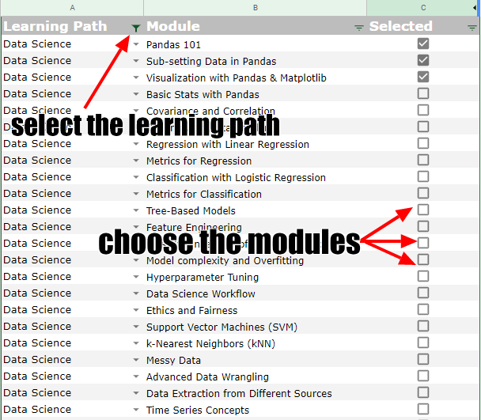

# Data Science Learning Path

Welcome to the Data Science Learning Path 🎉

This course is designed to cover most of the data science concepts you'll need to get started with.

The course is from the Lisbon Data Science Academy and can be accessed [here](https://github.com/LDSSA/batch5-students). It covers the following topics:

- Data Wrangling
- Binary Classification
- Time Series
- Text Classification
- Recommender Systems
- DS in the Real World

In this introduction, you'll learn:

- The principles driving your learning experience in this course.
- The structure of the course.
- The expectations for students and mentors.

## Learning Principles

When we assembled this course, we had in mind that our students would be adult individuals with time constraints. They will be looking to implement the knowledge in their work environment and maybe discuss it with their peers.

To fulfill these expectations, we adopted the following principles:

- Prefer self-directed learning over teacher-directed learning;
- Prefer content that's easily accessible (no paywalls or subscriptions);
- Prefer content that can be immediately applied;
- Always use code examples;
- Learning by teaching is encouraged.

## Learning Structure

The learning units available in the Lisbon Data Science Academy curriculum are as follows:

- S01 - Bootcamp and Binary Classification/
  - SLU01 - Pandas 101
  - SLU02 - Sub-setting Data in Pandas
  - SLU03 - Visualization with Pandas & Matplotlib
  - SLU04 - Basic Stats with Pandas
  - SLU05 - Covariance and Correlation
  - SLU06 - Dealing with Data Problems
  - SLU07 - Regression with Linear Regression
  - SLU08 - Metrics for Regression
  - SLU09 - Classification with Logistic Regression
  - SLU10 - Metrics for Classification
  - SLU11 - Tree-Based Models
  - SLU12 - Feature Engineering
  - SLU13 - Bias-Variance tradeoff & Model Selection
  - SLU14 - Model complexity and Overfitting
  - SLU15 - Hyperparameter Tuning
  - SLU16 - Data Science Workflow
  - SLU17 - Ethics and Fairness
  - SLU18 - Support Vector Machines (SVM)
  - SLU19 - k-Nearest Neighbors (kNN)
- S02 - Data Wrangling
  - BLU01 - Messy Data
  - BLU02 - Advanced Wrangling
  - BLU03 - Data Extraction from Different Sources
- S03 - Time Series
  - BLU04 - Time Series Concepts
  - BLU05 - Classical Time Series Models
  - BLU06 - Machine Learning for Time Series
- S04 - Text Classification
  - BLU07 - Feature Extraction
  - BLU08 - Dimensionality Reduction
  - BLU09 - Information Extraction
- S05 - Recommender Systems
  - BLU10 - Non-personalized recommender systems
  - BLU11 - Personalized Recommenders
  - BLU12 - Recommender Systems Workflow
- S06 - DS in the Real World
  - BLU13 - Basic Model Deployment
  - BLU14 - Deployment in Real World
  - BLU15 - Model Stability (CSI)

> **Note**: You'll find some folders with the `HCKTxx` prefix. These are the folders used on Hackathons at the Lisbon Data Science Academy.

As you can see, it's a pretty big course. However we don't expect that every student should complete all theses lessons: some might already be known to them, others might not be relevant in their current job context.

Students are to be divided into groups that share the same learning units. They are to be given a mentor who will guide them through the course and provide feedback on their progress.

**Mentors**: A mentor is a more experienced collaborator and/or chapter leads. They should be able to assess the skill level of their students and know what they need to learn to perform well at their projects.

They are in charge of helping their group, answering questions and preventing them from being stuck, as well as keeping track of their progress.

### Progress and Questions Tracking

In order to help mentors in tracking the progress of their groups, we suggest using the following template:

- [Progress  Question Tracking template](https://docs.google.com/spreadsheets/d/1nODnLBLCcC6Dqe_pK_bog-BA78E9AuUq1l4S81Px61w/edit?usp=sharing)

#### Setup

Each group should have its own copy of the template.

The mentor should select which courses will be part of the learning path inside the "Courses" tab:

  

This will add the courses to the learning path tracker.

  

#### Tracking questions

Tracking questions is important so that we can improve the quality of the selected material, as well as create new ones.

We understand that some chapters might be really close, and students might want to ask questions directly to the mentor, to also have the question available publicly is to everybody's advantage.

### Learning Unit Workflow

The Lisbon Data Science Academy has already implemented a workflow for students to complete their learning units. You can find it [here](https://github.com/LDSSA/batch5-students#learning-unit-workflow). However, since NOS is not affiliated with the LDSSA, there is one caveat.

> **Warning** The exercises are not to be graded. The LDSSA expects their students to push their code to their GitHub repo to be graded on their Portal.
>
> This is a limitation on our side, so please ignore grading instructions, which involve pushing code to their repo and logging in to their Portal.

## Expectations

### Expectations for students

Although we understand that time may be constrained, each student has responsibilities within their group, namely:

- Try to keep pace with the group's progress, neither falling too behind nor advancing too much by themselves.
- Be open in your discussions with the group, so that everyone can understand the material.
- Be courteous and respectful  to your peers and mentor.
- Set your progress expectations with your mentor.
- Conduct yourself with integrity and honesty.

### Expectations for mentors

A mentor are tasked in ensuring their peers become better professionals, as such, we expect them to:

- Reserve at least 30 minutes per week for each group you mentor, for answering questions and giving feedback.
- Encourage group members and communicate openly.
- Be courteous and respectful to your mentees.
- Keep track of questions and progress of the group members (see [Progress tracking](#progress-and-questions-tracking))
- Conduct yourself with integrity and honesty.

## Pre-requisites

In order to make the best use of this learning path, you should know:

- Basic / Intermediary Python: control flow, functions, handling errors, data structures, files, virtual environments, data manipulation libraries.
- Basic Git: add, commit, checkout, merge, and rebase
