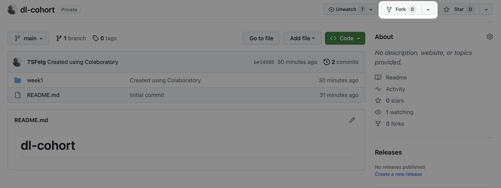
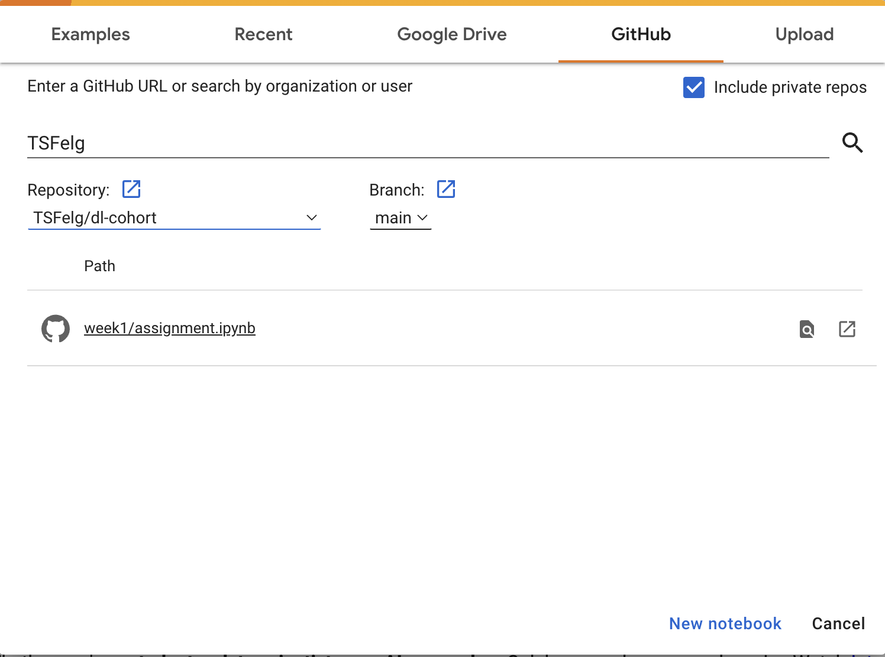
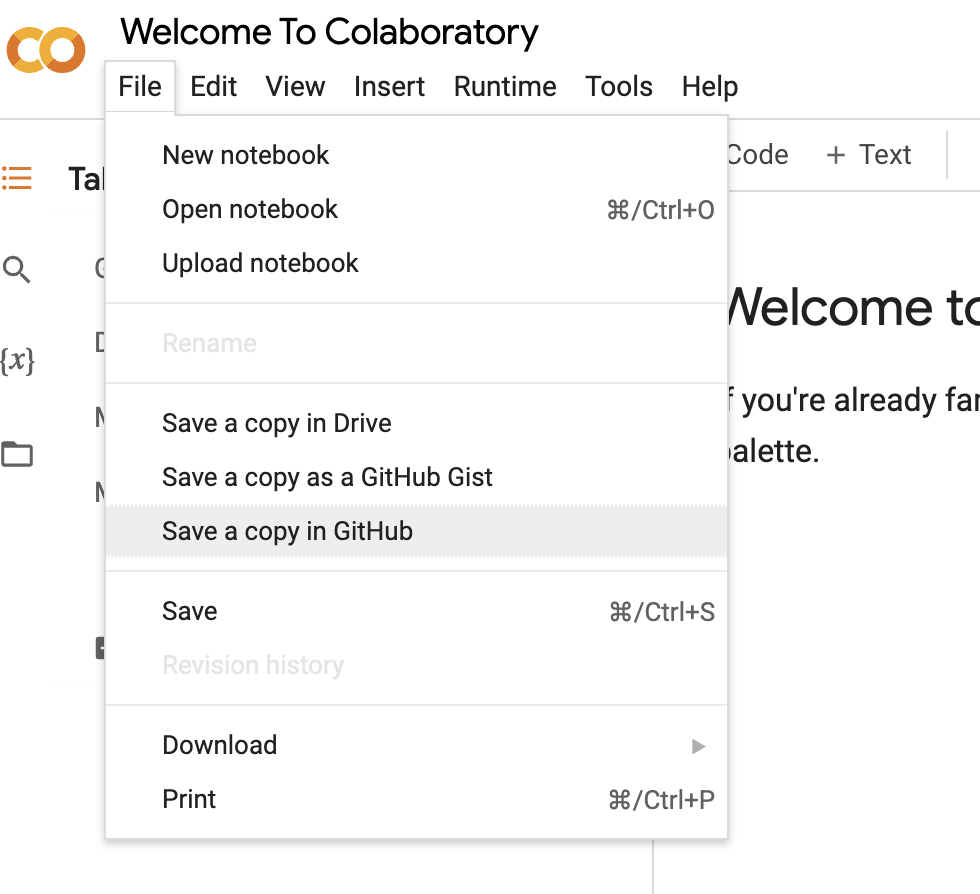

# Unit 1: Deep Learning Fundamentals

In this unit, you will be mostly watching videos, answering quizzes and testing the exercise notebook setup.

## Content

Watch the following content. We list some of the main concepts on each of the units; if you feel comfortable with them you can skip that lesson. If not, watch it and take the quizzes at the end of each sub-unit.

- [Deep Learning Fundamentals: Unit 1](https://lightning.ai/courses/deep-learning-fundamentals/unit-1/) (≈75 minutes)
  - Perceptron model
  - Weights & biases
  - Forward pass
  - Loss function
  - Model training: epochs, iterations & learning rates
  - Neural network initialization
- [Deep Learning Fundamentals: Unit 2](https://lightning.ai/courses/deep-learning-fundamentals/unit-2/) (≈ 40 minutes)
  - PyTorch & tensors
- [Deep Learning Fundamentals: Unit 3](https://lightning.ai/courses/deep-learning-fundamentals/unit-3/) (≈ 70 minutes)
  - Sigmoid activation function
  - Negative log-likelihood or binary cross-entropy
  - Gradient descent
  - Feature normalization

## Assignment

In this unit's assignment, you will setup your working environment for this course and test it by running a simple notebook. The instructions below should be easy to follow and get you started. If you have questions, do not hesitate to reach out to us on Slack.

1. Create a fork of this repo on your GitHub account.

   

2. Go to [Google Colab](https://colab.research.google.com/notebook) and open the Unit 1 assignment Jupyter notebook from your fork.

   

3. Run the notebook. Play with it and push the changes to your repo. Make sure to save it to the same pathname as the original file, as to not create a duplicate.

   

## Extra Materials

- [Deep playground](https://playground.tensorflow.org/) is a great interactive app for improving your intuition on how neural networks work.
- [3Blue1Brown's Deep Learning Playlist](https://www.youtube.com/watch?v=aircAruvnKk&list=PLZHQObOWTQDNU6R1_67000Dx_ZCJB-3pi&pp=iAQB) is an excellent resource with lots of visual representations of the inner workings of neural networks.
- [The spelled-out intro to neural networks and backpropagation: building micrograd](https://www.youtube.com/watch?v=VMj-3S1tku0&ab_channel=AndrejKarpathy) is an amazing walktrough of building [micrograd](https://github.com/karpathy/micrograd), a minimal library for training neural networks. You basically get to see one of the best DL educators (Andrej Karpathy) build a minimal version of PyTorch. It's great for really understanding backpropagation.
