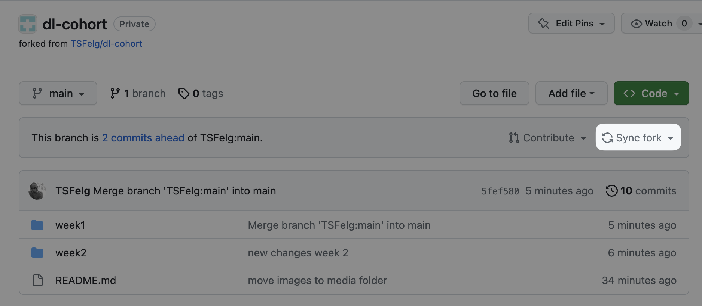

# Unit 2: Neural Networks

In this unit you will start getting hands-on experience training neural networks in PyTorch and test your skills by classifying the sentiment expressed in movie reviews.

## Content

Watch the following content. We list some of the main concepts on each of the units; if you feel comfortable with them you can skip that lesson. If not, watch it and take the quizzes at the end of each sub-unit.

- [Deep Learning Fundamentals: Units 4](https://lightning.ai/courses/deep-learning-fundamentals/training-multilayer-neural-networks-overview/) (≈115 minutes)
- [Deep Learning Fundamentals: Units 8.1](https://lightning.ai/courses/deep-learning-fundamentals/unit-8.0-natural-language-processing-and-large-language-models/8.1-working-with-text-data/) (≈ 5 minutes)
- [Deep Learning Fundamentals: Units 8.2](https://lightning.ai/courses/deep-learning-fundamentals/unit-8.0-natural-language-processing-and-large-language-models/8.2-training-a-text-classifier-baseline/) (≈ 25 minutes)
 
## Assignment
 1. Create an account on [Kaggle](https://www.kaggle.com) if you don't have one already;
 2. Head to this [Kaggle competition](https://www.kaggle.com/competitions/word2vec-nlp-tutorial/overview) and download the data files `labeledTrainData.tsv.zip` and `testData.tsv.zip`. Start by reading and accepting the competition rules on the [Rules tab](https://www.kaggle.com/competitions/word2vec-nlp-tutorial/rules), and then download the data files from the [Data tab](https://www.kaggle.com/c/word2vec-nlp-tutorial/data);
 3. Unzip both files and upload them to your Google Drive to a folder named `ldsa-dl-course-data` on your root directory;
 4. Sync the latest changes on the base repo to your fork.
       
       

1. Go to [Google Colab](https://colab.research.google.com/notebook) and open the Unit 2 assignment Jupyter Notebook from your fork and follow the directions there.

## Extra Materials
- [The spelled-out intro to language modeling: building makemore
](https://www.youtube.com/watch?v=PaCmpygFfXo&ab_channel=AndrejKarpathy): Andrej is back with an excellent introduction to how neural networks can be used for language models. Here the scope is for next word prediction, not text classification like our assignment, but the same principles apply.